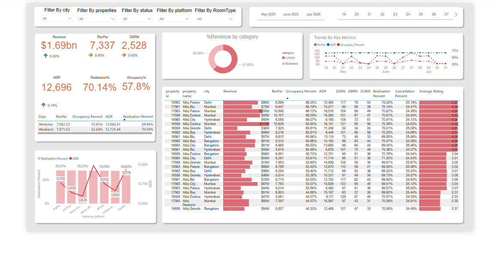

# 🏨 Hospitality Data Analysis & Interactive Dashboard

Welcome to my **Hospitality Data Analysis** project — a hands-on data cleaning, transformation, and visualization project designed to extract key business insights from real-world hospitality data. This project demonstrates my ability to handle messy data, build KPIs, and present insights interactively using **Power BI**.

## 📂 Project Overview

The dataset, obtained from a hospitality platform, includes booking, guest, and revenue-related data. My objective was to clean and explore the dataset, and then deliver a visually intuitive **dashboard** highlighting performance metrics.

## 🔧 Tools & Technologies

- **Power BI**: For creating dynamic, interactive dashboards
- **Python (Pandas)**: For initial data cleaning and transformation
- **Jupyter Notebook**: For exploratory data analysis (EDA)
- **Excel/CSV**: Original data format used for import and cleaning

---

## 📈 Key Features of the Dashboard

- ✅ **Total Bookings** and trends over time  
- 🌍 **Regional Analysis** of guest bookings  
- 💵 **Revenue KPIs** including average revenue per guest  
- 🛌 **Booking Channel Analysis**  
- 📅 **Seasonality Insights** with monthly/quarterly trends  
- 🔍 **Slicer Filters**: Dynamic filtering by country, date range, room type, and more

---

## 📊 Sample Dashboard (Power BI)




---

## 🚀 What I Learned

- Translating raw business data into actionable insights
- Designing clean, business-friendly dashboards
- Data wrangling techniques using Pandas
- End-to-end analytical storytelling from raw CSV to executive report

---

## 📌 How to Use

1. Clone the repo  
```bash
git clone https://github.com/Karanpreet03/HospitalityAnalysis.git
